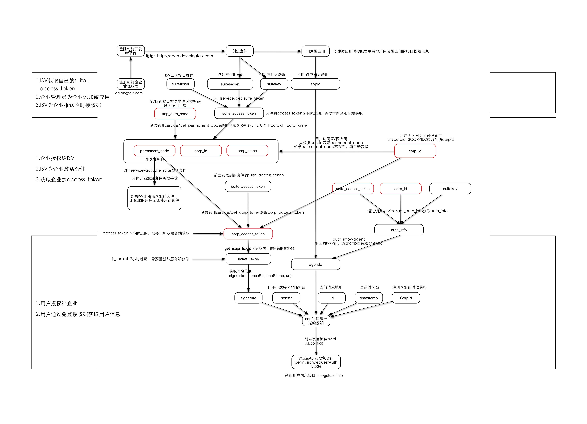
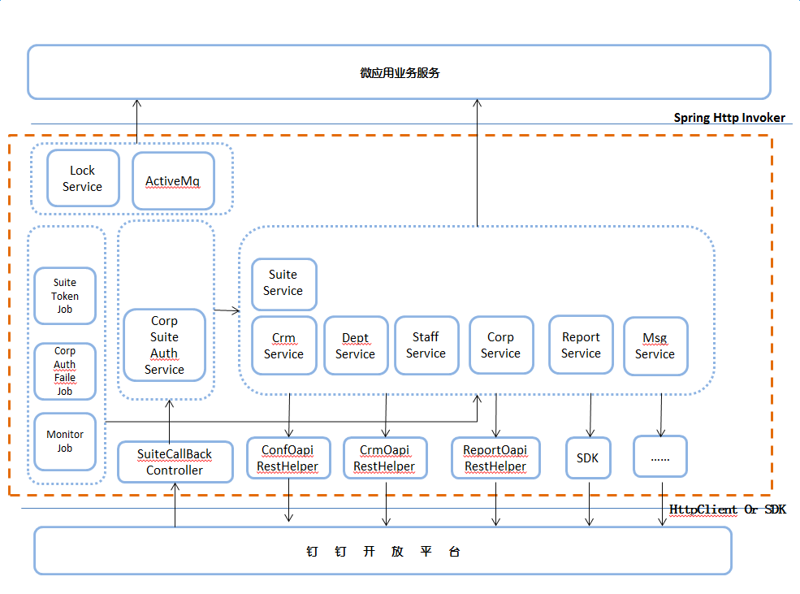
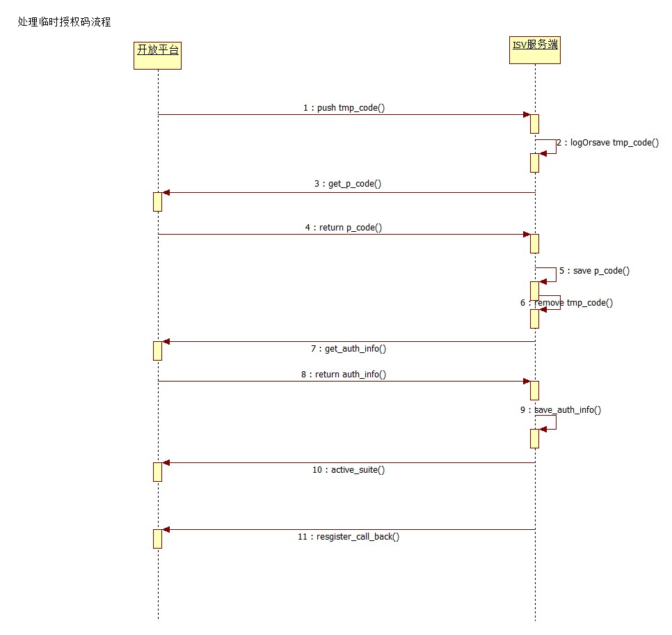

ISV接入DEMO
======================

钉钉开发者平台ISV接入详细示例以及代码(JAVA版本)

## 功能列表
- 创建ISV套件及应用
- 应用授权及管理
- ISV免登鉴权
- 服务窗授权及应用DEMO

## 安装及部署

###先决条件:

- 具有公网IP的服务器，假设IP地址为a.b.c.d
- JAVA，需要安装[JCE补丁](https://stackoverflow.com/questions/6481627/java-security-illegal-key-size-or-default-parameters#answers)
- TOMCAT，假设端口为8080
- MySQL，新建名称为ding_isv_access数据库
- Maven

###部署流程:
```sh
# 下载代码
git clone https://github.com/hetaoZhong/ding-isv-access.git
# 导入数据库文件
mysql -u root -p ding_isv_access < db_sql.sql
```

进入[开发者平台](http://open-dev.dingtalk.com)并创建ISV套件，如下填写这几项，填写完先不要点确定
- Token: 任意字符串
- 数据加密密钥: 点击自动生成
- IP白名单: a.b.c.d
- 回调地址: http://a.b.c.d:8080/ding-isv-access/suite/create

修改web/src/main/webapp/META-INF/autoconfig/auto-config.xml, 配置mysql数据库、用户名、密码;
并修改suite.token, suite.aes的值分别对应上面的Token和加密密钥

```sh
# 清理auto-config
rm -rf ~/antx.properties
# 编译
mvn clean package -Dmaven.test.skip=true
# 部署ding-isv-access.war，参见delpoy-ding-isv-access.sh
# 第一个参数为TOMCAT路径
./delpoy-ding-isv-access.sh /usr/local/tomcat
```
这个时候如果配置无误的话，打开浏览器
http://a.b.c.d:8080/ding-isv-access/checkpreload.htm
页面，会看到success。同时在创建套件页面点击"验证回调URL有效性"，
会有成功提示。

至此ISV套件即可成功创建。如果遇到问题，可在对应的log文件中检查相关信息:
- {TOMCAT_DIR}/logs/localhost.log 工程加载日志
- {LOG_DIR}/isv-crm-access.log tomcat的ding-isv-access工程启动情况
- {LOG_DIR}/biz/http_request_helper.log 所有通过httpclient开放平台请求的http记录
- {LOG_DIR}/biz/http_invoke.log 所有通过sdk开放平台请求的http记录
- {LOG_DIR}/biz/task.log 所有quzrtz任务日志。包括定时生成suitetoken
- {LOG_DIR}/biz/suite_callback.log 所有开放平台调用套件回调信息的日志
- {LOG_DIR}/biz/monitor.log suitetoken是否正常接收,正常更新

###激活套件:
为了能够在企业页面打开并测试微应用，还需要完成下面的步骤:
1. 进入套件管理页面，记下套件名称、Token、数据加密密钥、套件Key、套件secret
2. 在MySQL数据库中插入下面信息
`insert into isv_suite(id, gmt_create, gmt_modified, suite_name, suite_key,
suite_secret, encoding_aes_key, token, event_receive_url)
values(1, NOW(), NOW(), '套件名称', '套件Key', '套件secret','数据加密密钥', 'Token', '');`
注意替换相应字符串
3. 点击修改套件，修改回调URL为`http://a.b.c.d:8080/ding-isv-access/suite/callback/{套件Key}`
，注意替换套件Key
4. 在套件管理页面点击创建微应用，主页地址填为`http://a.b.c.d:8080/ding-isv-access/microapp.html?corpId=$CORPID$`
5. 在套件管理页面点击创建测试企业，建立一个企业用于授权激活套件
6. 返回套件管理页面，在授权管理中选择刚创建的企业对套件进行授权

如果配置无误，几秒后刷新页面，可看到企业授权成功。打开钉钉客户端，
在企业管理页面选择创建的测试企业，可以看到刚创建的微应用已经在列表中可以访问。

##详细API
原始API文档请参见[API文档](https://open-doc.dingtalk.com/?spm=a219a.7629140.0.0.t6niFE)
###流程图

###代码结构


上图说明如下:

1. 开放平台通过SuiteCallBackController提供的RPC接口推送事件。
      包括
   1) 企业授权套件过程中的临时授权码,权限变更,权限解除等等,RPC接口通过CorpSuiteAuthService处理企业授权事件
   2) 企业信息发生变更的回调事件,员工变更,部门变更,群会话变更等等,RPC接口处理这些事件之后,通过ACTIVEMQ向各个微应用业务方传播该时间

2. SuiteService,CrmService,DeptService等具体的业务代码,是封装了开放平台提供的http接口。
    这些Service接口通过各种RestHelper向开放平台请求数据,例如ConfOapiRestHelper。
     同时这些Service也通过springhttpinvoker向微应用业务方提供方法调用
3. SuiteTokenJob,CorpAuthFaileJob,MonitorJob 服务是定时任务.定时生成token,处理授权失败,监控等

4. LockSerive是锁服务。  ActiveMq为处理消息jms模板

###企业授权套件流程图

1.接收开放平台的临时授权码推送
2.临时授权码做存储,db或者log
3/4/5/6.使用临时授权码换取永久授权码。如果失败,计入失败表,使用定时任务做重试
7/8/9.调用开放平台接口获取企业和微应用信息,做存储。如果失败,计入失败表,使用定时任务做重试
10.调用开放平台接口激活套件。如果失败,计入失败表,使用定时任务做重试
11.注册企业对套件的回调地址。如果失败,计入失败表,使用定时任务做重试