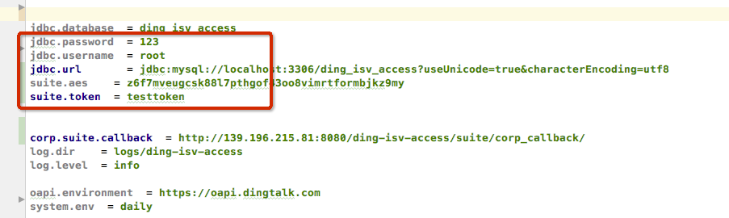

ISV接入DEMO
======================

钉钉开发者平台ISV接入详细示例以及代码(JAVA版本)

### 功能列表
- 创建ISV套件及应用
- 应用授权及管理
- ISV免登鉴权
- 服务窗授权及应用DEMO

## 安装及部署

### 先决条件:

- 具有公网IP的服务器，假设IP地址为a.b.c.d
- JAVA，需要安装[JCE补丁](https://stackoverflow.com/questions/6481627/java-security-illegal-key-size-or-default-parameters#answers)
- TOMCAT，假设端口为8080
- MySQL，新建名称为ding_isv_access数据库
- Maven

## 部署流程:

### 下载代码
git clone https://github.com/open-dingtalk/isv-demo-java.git

### 导入数据库文件
mysql -u root -p ding_isv_access < db_sql.sql

### 在[antx.properties](./antx.properties)中修改数据库和套件的配置项

#### 配置项说明

* 配置mysql数据库、用户名、密码; 
* suite.token, suite.aes的值分别`创建套件时填写的Token和加密密钥`

### 编译打包

mvn   -Dmaven.test.skip=true  -Dautoconfig.interactive=false  clean package

### 部署ding-isv-access.war，参见delpoy-ding-isv-access.sh

* 第一个参数为TOMCAT路径
* ./delpoy-ding-isv-access.sh /usr/local/tomcat

#### 注意启动失败或访问不了Demo首页：

* 查看数据的表名是否为大写。 mysql没有设置数据不区分大小写，会导致启动创建quartz的相关Bean失败。  
* 这个时候如果配置无误的话，打开浏览器[http://a.b.c.d:8080/ding-isv-access/checkpreload.htm](http://a.b.c.d:8080/ding-isv-access/checkpreload.htm)，会看到浏览器显示success。说明项目已经部署成功。

## 创建套件
进入[开发者平台](http://open-dev.dingtalk.com)并创建ISV套件，如下填写参数的值：

- Token: 任意字符串
- 数据加密密钥: 点击自动生成
- IP白名单: a.b.c.d

点击下一步完成回调地址验证

- 回调地址: http://a.b.c.d:8080/ding-isv-access/suite/create/{替换成自己的suiteKey}

点击验证有效性。 页面显示`检查成功`后，就可以点击确定，成功创建套件。

至此ISV套件即可成功创建。如果遇到问题，可在对应的log文件中检查相关信息:
 
- {TOMCAT_DIR}/logs/localhost.log 工程加载日志
- {LOG_DIR}/isv-crm-access.log tomcat的ding-isv-access工程启动情况
- {LOG_DIR}/biz/http_request_helper.log 所有通过httpclient开放平台请求的http记录
- {LOG_DIR}/biz/http_invoke.log 所有通过sdk开放平台请求的http记录
- {LOG_DIR}/biz/task.log 所有quzrtz任务日志。包括定时生成suitetoken
- {LOG_DIR}/biz/suite_callback.log 所有开放平台调用套件回调信息的日志
- {LOG_DIR}/biz/monitor.log suitetoken是否正常接收,正常更新

### 激活套件:
为了能够在企业页面打开并测试微应用，还需要完成下面的步骤:

1. 进入套件管理页面，记下套件名称、Token、数据加密密钥、套件Key、套件secret
2. 在MySQL数据库中插入新建套件信息**非常重要**
`insert into isv_suite( gmt_create, gmt_modified, suite_name, suite_key,
suite_secret, encoding_aes_key, token, event_receive_url)
values( NOW(), NOW(), '套件名称', '套件Key', '套件secret','数据加密密钥', 'Token', '');`
注意替换相应字符串
3. 点击修改套件，修改回调URL为`http://a.b.c.d:8080/ding-isv-access/suite/callback/{套件Key}`（套件Key为创建套件成功后套件列表里的套件key）
，注意替换套件Key
4. **消息推送管理**显示Ticket推送状态为推送成功后。在套件管理页面点击创建微应用，主页地址填为`http://a.b.c.d:8080/ding-isv-access/microapp.html?corpId=$CORPID$` ($CORPID$为占位符直接替换ip后直接拷贝过去就行)
6. 在套件管理页面点击创建测试企业，建立一个企业用于授权激活套件
7. 返回套件管理页面，在授权管理中选择刚创建的企业对套件进行授权
8. 如果配置无误，页面会提示几秒后后刷新页面，可看到企业授权成功。 （由于后端代码流控设置，需要等待一段时间（大概30分左右）才能看到授权成功的企业列表。） 
9. 返回测试企业列表，点击已授权成功的测试企业的**登录管理**按钮，会提示你如何登录测试企业。（不然你在钉钉客户端会找不到该测试企业。可以参考文档[ISV应用开发示例](https://open-doc.dingtalk.com/docs/doc.htm?spm=a219a.7629140.0.0.1OyypP&treeId=366&articleId=107560&docType=1)中的激活套件介绍如何登录创建的测试企业。）
   
10. 返回打开钉钉客户端，在企业管理页面选择创建的测试企业，可以看到刚创建的微应用已经在列表中可以访问。

## 接入层代码分析
原始API文档请参见[API文档](https://open-doc.dingtalk.com/?spm=a219a.7629140.0.0.t6niFE)
### 流程图

### 代码结构

上图说明如下:

1. 开放平台通过SuiteCallBackController提供的RPC接口推送事件。
      包括
   1) 企业授权套件过程中的临时授权码,权限变更,权限解除等等,RPC接口通过CorpSuiteAuthService处理企业授权事件
   2) 企业信息发生变更的回调事件,员工变更,部门变更,群会话变更等等,RPC接口处理这些事件之后,通过ACTIVEMQ向各个微应用业务方传播该时间

2. SuiteService,CrmService,DeptService等具体的业务代码,是封装了开放平台提供的http接口。
    这些Service接口通过各种RestHelper向开放平台请求数据,例如ConfOapiRestHelper。
     同时这些Service也通过springhttpinvoker向微应用业务方提供方法调用
3. SuiteTokenJob,CorpAuthFaileJob,MonitorJob 服务是定时任务.定时生成token,处理授权失败,监控等

4. LockSerive是锁服务。  ActiveMq为处理消息jms模板

### 企业授权套件流程图

- 1.接收开放平台的临时授权码推送
- 2.临时授权码做存储,db或者log
- 3/4/5/6.使用临时授权码换取永久授权码。如果失败,计入失败表,使用定时任务做重试
- 7/8/9.调用开放平台接口获取企业和微应用信息,做存储。如果失败,计入失败表,使用定时任务做重试
- 10.调用开放平台接口激活套件。如果失败,计入失败表,使用定时任务做重试
- 11.注册企业对套件的回调地址。如果失败,计入失败表,使用定时任务做重试

### 数据库表说明

+---------------------------------------------+

| Tables_in_ding_isv_access              |

+-----------------------------+

| QRTZ_BLOB_TRIGGERS                |         QRTZ前缀表明为spring-quarzt用到的表

| QRTZ_CALENDARS                        |

| QRTZ_CRON_TRIGGERS              |

| QRTZ_FIRED_TRIGGERS              |

| QRTZ_JOB_DETAILS                      |

| QRTZ_LOCKS                                 |

| QRTZ_PAUSED_TRIGGER_GRPS |

| QRTZ_SCHEDULER_STATE           |

| QRTZ_SIMPLE_TRIGGERS            |

| QRTZ_SIMPROP_TRIGGERS         |

| QRTZ_TRIGGERS                           |

| isv_app                                             |       ISV套件下的微应用信息

| isv_biz_lock                                      |       锁表。 由于系统没有采用redis之类的缓存,所以用了数据库表来实现业务上的加锁功能

| isv_corp                                            |       企业信息表

| isv_corp_app                                    |       企业开通微应用表

| isv_corp_suite_auth                         |       企业授权套件信息

| isv_corp_suite_auth_faile                |        企业授权套件过程中,失败的数据。由定时任务定时处理这个表中的数据进行重试

| isv_corp_suite_callback                   |       企业对套件的回调注册url表(当前这张表没有使用)  

| isv_corp_suite_jsapi_ticket              |        企业的jsapiticke表

| isv_corp_token                                |         企业的accesstoken表

| isv_suite                                          |         ISV套件下的套件信息

| isv_suite_ticket                                |         ISV套件的suiteticket表

| isv_suite_token                                |         ISV套件的suitetoken表.这张表的信息由定时任务定时刷新

+--------------------------------------------+

